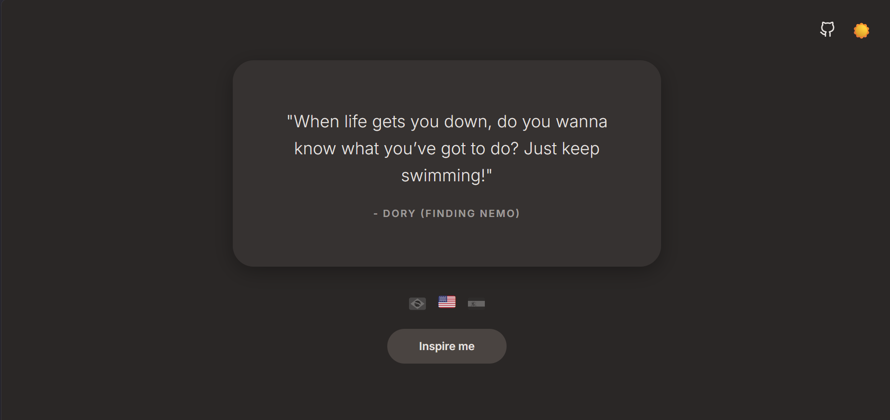
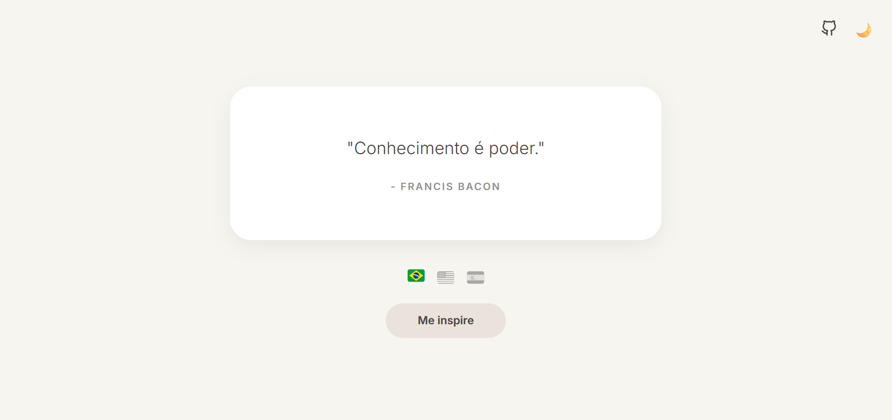

# Inspire - Gerador de Inspiração

--> https://publiodavi.github.io/project-inspire/
Um projeto minimalista e elegante desenvolvido para fornecer citações inspiradoras de grandes pensadores, figuras históricas e filmes icônicos.

  
  &nbsp;
  

## Funcionalidades

- **Multilíngue (i18n):** Suporte nativo para Português (PT-BR), Inglês (EN) e Espanhol (ES). A interface e os dados são traduzidos instantaneamente ao selecionar a bandeira correspondente.
- **Dark/Light Mode:** Alternância de tema suave e moderna utilizando *CSS Custom Properties* (Variáveis CSS), garantindo uma experiência visual confortável (UI/UX).
- **Consumo de Dados Assíncrono:** Utilização da `Fetch API` para consumir um banco de dados local (`JSON`) contendo 150 frases cuidadosamente selecionadas.
- **Prevenção de Repetição:** Lógica de estado no JavaScript que garante que a mesma frase não seja sorteada duas vezes seguidas.
- **Design Responsivo e Minimalista:** Foco total na legibilidade, tipografia e layout centralizado.

## Tecnologias Utilizadas

- **HTML5** (Estrutura semântica)
- **CSS3** (Variáveis, Flexbox, Transições suaves)
- **Vanilla JavaScript** (Manipulação de DOM, Fetch API, Gerenciamento de Estado)
- **JSON** (Estruturação de dados)

## Aprendizados e Arquitetura

Este projeto foi desenvolvido com o foco em aplicar conceitos de arquitetura de software no front-end. A escolha de não utilizar frameworks e focar inteiramente em **Vanilla JS** teve como objetivo aprofundar o domínio sobre requisições assíncronas, gerenciamento de estado da interface e o uso eficiente do formato JSON para simular o comportamento de uma API real. 

## Autor

**Davi de Souza Públio**
Estudante de Análise e Desenvolvimento de Sistemas (ADS) na FATEC.

- [Acesse meu GitHub](https://github.com/publiodavi)
